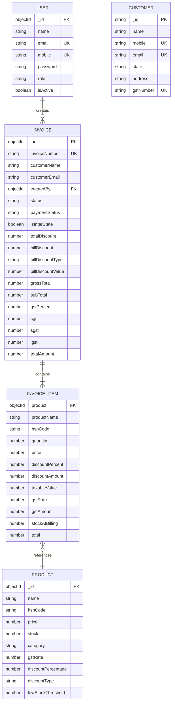

# Inventory & Billing System - ER Diagram & Database Schema

## Mermaid ER Diagram (GitHub Compatible)



---

## ASCII ER Diagram

```
┌──────────────────────────────────────────────────────────────────────────────┐
│                                   USER                                       │
│                              (Admin/Cashier)                                 │
├──────────────────────────────────────────────────────────────────────────────┤
│ PK  _id              ObjectId                                                │
│     name             String (required)                                      │
│     email            String (unique, required)                              │
│     mobile           String (unique, required)                              │
│     password         String (required)                                      │
│     role             Enum: [admin, cashier]                                 │
│     isActive         Boolean (default: true)                               │
└─────────────────────────────────┬────────────────────────────────────────────┘
                                  │ 1:N
                                  ▼
┌──────────────────────────────────────────────────────────────────────────────┐
│                                  INVOICE                                     │
├──────────────────────────────────────────────────────────────────────────────┤
│ PK  _id              ObjectId                                                │
│     invoiceNumber    String (unique, required)                              │
│     customerName     String (required)                                      │
│     customerEmail    String                                                  │
│ FK  createdBy        ObjectId → User                                        │
│     status           Enum: [Active, Cancelled]                              │
│     paymentStatus    Enum: [Unpaid, Paid]                                   │
│     isInterState     Boolean (default: false)                               │
├──────────────────────────────────────────────────────────────────────────────┤
│                              BILLING                                         │
├──────────────────────────────────────────────────────────────────────────────┤
│     totalDiscount    Number                                                  │
│     billDiscount     Number                                                  │
│     billDiscountType Enum: [percentage, flat]                              │
│     billDiscountValue Number                                                │
│     grossTotal       Number                                                  │
│     subTotal         Number (required)                                      │
│     gstPercent       Number (required)                                      │
│     cgst             Number (required)                                      │
│     sgst             Number (required)                                      │
│     igst             Number (required)                                      │
│     totalAmount      Number (required)                                      │
├──────────────────────────────────────────────────────────────────────────────┤
│     createdAt        Date                                                    │
│     updatedAt        Date                                                    │
└─────────────────────────────────┬────────────────────────────────────────────┘
                                  │ 1:N
                                  ▼
┌──────────────────────────────────────────────────────────────────────────────┐
│                               INVOICE ITEM                                    │
├──────────────────────────────────────────────────────────────────────────────┤
│ FK  product          ObjectId → Product                                     │
│     productName      String (snapshot)                                     │
│     hsnCode          String                                                  │
│     quantity         Number (min: 1)                                        │
│     price            Number                                                  │
│     discountPercent  Number                                                  │
│     discountAmount   Number                                                  │
│     taxableValue    Number                                                  │
│     gstRate          Number (0, 5, 12, 18, 28)                              │
│     gstAmount        Number                                                  │
│     stockAtBilling   Number                                                  │
│     total            Number                                                  │
└──────────────────────────────────────────────────────────────────────────────┘

┌──────────────────────────────────────────────────────────────────────────────┐
│                                 CUSTOMER                                      │
├──────────────────────────────────────────────────────────────────────────────┤
│ PK  _id              ObjectId                                                │
│     name             String (required)                                      │
│     mobile           String (unique, required)                              │
│     email            String (unique, sparse)                                │
│     state            String (default: Gujarat)                             │
│     address          String                                                  │
│     gstNumber        String (unique, sparse)                               │
│     createdAt        Date                                                    │
│     updatedAt        Date                                                    │
└──────────────────────────────────────────────────────────────────────────────┘

┌──────────────────────────────────────────────────────────────────────────────┐
│                                  PRODUCT                                      │
├──────────────────────────────────────────────────────────────────────────────┤
│ PK  _id              ObjectId                                                │
│     name             String (required)                                      │
│     hsnCode          String (required)                                      │
│     price            Number (required)                                      │
│     stock            Number (default: 0)                                    │
│     category         String (required)                                      │
│     gstRate          Number (required, enum: 0,5,12,18,28)                 │
│     discountPercentage Number (default: 0)                                 │
│     discountType      Enum: [percentage, flat]                              │
│     lowStockThreshold Number (default: 10)                                 │
│     createdAt        Date                                                    │
│     updatedAt        Date                                                    │
└──────────────────────────────────────────────────────────────────────────────┘
```

---

## Relationships

```
┌──────────┐         ┌──────────┐         ┌──────────┐
│   USER   │         │ INVOICE  │         │ INVOICE  │
│          │         │          │         │  ITEM    │
│  (1)     │────────▶│  (N)     │────────▶│  (N)     │
└──────────┘         └──────────┘         └────┬─────┘
                                                 │
                                                 ▼
                                          ┌──────────┐
                                          │ PRODUCT  │
                                          │  (1)     │
                                          └──────────┘
```

| Relationship | Type | Description |
|--------------|------|-------------|
| User → Invoice | 1:N | One user creates many invoices |
| Invoice → Items | 1:N | One invoice has many line items |
| Item → Product | N:1 | Each item references one product |

---

## Database Schema

### User Model
| Field | Type | Constraints |
|-------|------|-------------|
| name | String | required |
| email | String | unique, required |
| mobile | String | unique, required |
| password | String | required |
| role | Enum | [admin, cashier], default: cashier |
| isActive | Boolean | default: true |

### Customer Model
| Field | Type | Constraints |
|-------|------|-------------|
| name | String | required |
| mobile | String | unique, required |
| email | String | unique, sparse |
| state | String | default: Gujarat |
| address | String | - |
| gstNumber | String | unique, sparse |

### Product Model
| Field | Type | Constraints |
|-------|------|-------------|
| name | String | required, trim |
| hsnCode | String | required |
| price | Number | required |
| stock | Number | default: 0 |
| category | String | required |
| gstRate | Number | required, enum: [0,5,12,18,28], default: 18 |
| discountPercentage | Number | default: 0 |
| discountType | Enum | [percentage, flat], default: percentage |
| lowStockThreshold | Number | default: 10 |

### Invoice Model
| Field | Type | Constraints |
|-------|------|-------------|
| invoiceNumber | String | unique, required |
| customerName | String | required |
| customerEmail | String | - |
| createdBy | ObjectId | FK → User, required |
| items | Array | Invoice items |
| status | Enum | [Active, Cancelled], default: Active |
| paymentStatus | Enum | [Unpaid, Paid], default: Unpaid |
| isInterState | Boolean | default: false |
| totalDiscount | Number | item-level total |
| billDiscount | Number | bill-level discount |
| billDiscountType | Enum | [percentage, flat] |
| billDiscountValue | Number | actual discount value |
| grossTotal | Number | MRP total |
| subTotal | Number | required |
| gstPercent | Number | required |
| cgst | Number | required |
| sgst | Number | required |
| igst | Number | required |
| totalAmount | Number | required |

---

## GST Calculation

```
┌────────────────────────────────────────────────────────────────┐
│                      ITEM LEVEL                                │
├────────────────────────────────────────────────────────────────┤
│ taxableValue = (price × quantity) - discount                   │
│ gstAmount    = taxableValue × (gstRate / 100)                 │
│ itemTotal    = taxableValue + gstAmount                       │
└────────────────────────────────────────────────────────────────┘

┌────────────────────────────────────────────────────────────────┐
│                      BILL LEVEL                                │
├────────────────────────────────────────────────────────────────┤
│ grossTotal    = Σ(item.price × item.quantity)                 │
│ totalDiscount = Σ(item.discountAmount) + billDiscount         │
│ subTotal      = grossTotal - totalDiscount                    │
└────────────────────────────────────────────────────────────────┘

┌────────────────────────────────────────────────────────────────┐
│                    GST SPLIT (Intra-State)                    │
├────────────────────────────────────────────────────────────────┤
│ CGST = subTotal × gstPercent / 2                              │
│ SGST = subTotal × gstPercent / 2                              │
│ IGST = 0                                                      │
└────────────────────────────────────────────────────────────────┘

┌────────────────────────────────────────────────────────────────┐
│                   GST SPLIT (Inter-State)                     │
├────────────────────────────────────────────────────────────────┤
│ CGST = 0                                                      │
│ SGST = 0                                                      │
│ IGST = subTotal × gstPercent                                  │
└────────────────────────────────────────────────────────────────┘

totalAmount = subTotal + CGST + SGST + IGST
```

---

## Indexes

| Model | Field | Type | Purpose |
|-------|-------|------|---------|
| User | email | Unique | Login |
| User | mobile | Unique | Login |
| Customer | mobile | Unique | Search |
| Customer | email | Unique | Search |
| Customer | gstNumber | Unique | GST |
| Product | name | Index | Search |
| Product | category | Index | Filter |
| Invoice | invoiceNumber | Unique | Lookup |
| Invoice | createdBy | Index | User invoices |
| Invoice | createdAt | Index | Reports |

---

## Validation Rules

- **GST Rates**: Only 0%, 5%, 12%, 18%, 28% allowed
- **Discount Types**: "percentage" or "flat"
- **Invoice Status**: "Active" or "Cancelled"
- **Payment Status**: "Unpaid" or "Paid"
- **User Roles**: "admin" or "cashier"
- **Quantity**: Minimum 1 for invoice items